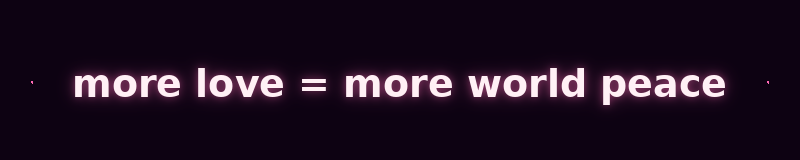

 

  

# You just got love bombed.

Don't worry. It only contains one idea.

  

   

 

  

 

Read that again if you need to. Sit with it for a second.

Not a slogan. Not a bumper sticker. Just a sentence so plainly true
that it's strange no one has put it at the center of every conversation
about war, conflict, and what to do about either.

 

 

## 💗 The obvious thing nobody is saying

Every conflict — between nations, between neighbors, between strangers online — shares the same deficiency.

Not resources. Not policy. Not diplomacy.

***Love.***

Ask the simplest possible question about any conflict in human history:

> *Would more love between those people have made it better or worse?*

The answer has never once been *"worse."*&ensp;Not once.

And yet somehow, in all the serious rooms where serious people discuss
serious solutions, this word barely comes up.

That's not because it's naive.
It's because no one wants to say the obvious thing first.

 

 

## 💌 That's where you come in

A love bomb is what you're reading right now. It's this page. It's the
link you can send to someone — a friend, a stranger, a comment section,
a group chat, a dinner table conversation.

It works the same way every idea that ever changed the world worked:

> **One person says it. Another person hears it.**
> **It becomes harder to unsay.**

No algorithm. No ad spend. No organization.
Just people saying a quiet, obvious truth out loud
until it isn't quiet anymore.

That's social proof — the oldest force in human behavior.
Once enough people hear ***more love = more world peace*** regularly,
it stops sounding like idealism and starts sounding like common sense.

Because it is.

 

 

## 💕 Send a love bomb

Share this page with one person. That's it.

No signup. No merch. No manifesto. No commitment beyond the one you
already made the moment you read the equation and thought:

***"...yeah."***

 

---

 

 

You've been love bombed.

Now someone's waiting for theirs.

 

 

*It was always this simple.*

 

  

