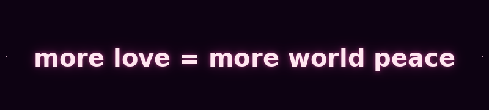
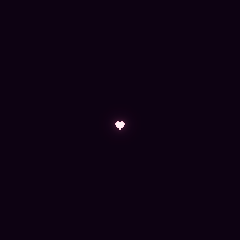

**Now with 5 love bomb variations — because love should feel personal.**

💗 **Philly Love Park** — Inspired by the LOVE sculpture. The City of Brotherly Love, radiating outward.

🏙️ **NYC** — From Brooklyn to Manhattan. In a city of 8 million, this one's just for you.

🇺🇸 **United States** — Coast to coast. Love crosses every mile.

🏳️‍🌈 **LGBTQ+** — Love is love. Chosen family. Rainbow hearts. You, exactly as you are.

🌍 **Multi-language** — Te amo · Je t'aime · 我爱你. Love needs no translation.

## Choose your variation

Pick at the top of the page, or share a direct link:

- [Classic](https://thumpersecure.github.io/LOVE-BOMB/)
- [Philly Love Park](https://thumpersecure.github.io/LOVE-BOMB/?v=philly)
- [NYC](https://thumpersecure.github.io/LOVE-BOMB/?v=nyc)
- [United States](https://thumpersecure.github.io/LOVE-BOMB/?v=usa)
- [LGBTQ+](https://thumpersecure.github.io/LOVE-BOMB/?v=lgbtq)
- [Multi-language](https://thumpersecure.github.io/LOVE-BOMB/?v=multilang)

Shared links keep the chosen variation.

 

  

# 💌 You just got love bombed.

**Don't panic.** It only contains one idea.
 And once you see it, you can't unsee it.

  

   

 

  

 

 

> *Give this 90 seconds. That's all it asks.*

 

## 💗 The obvious thing nobody is saying

Every conflict — between nations, between neighbors, between strangers online — shares the same deficiency.

Not resources. Not policy. Not diplomacy.

### ***Love.***

Ask the simplest possible question about any conflict in human history:

> ***Would more love between those people have made it better… or worse?***

The answer has never once been *"worse."*

Not once. In all of human history. **Not. Once.**

And yet somehow — in all the serious rooms where serious people discuss serious solutions — this word barely comes up. Not because it's naive. Because **no one wants to say the obvious thing first.**

You just did. You just read it. And now you can't un-read it.

 

  

## 💜 You already know this is true

You knew it before you opened this page.

Every single person who reads that equation has the same reaction. The same quiet, internal moment of:

### *"…yeah."*

That reaction — that one — is **the most honest thing you've felt today.** Don't let it pass. Don't scroll past it. Sit in it for one second.

That feeling is not naive. It's not soft. It's the most clear-eyed observation anyone can make about the state of the world:

> **We do not have a weapons problem. We do not have a diplomacy problem. We have a love deficiency. And the equation to fix it has been right in front of us the entire time.**

The reason nobody says it isn't because nobody believes it. ***Everyone believes it.*** The problem is that nobody says it out loud — so it stays invisible in exactly the spaces where it matters most.

Until now.

 

  

## 💌 How a love bomb works

A love bomb is what you're reading right now. It's this page. It's the feeling it just gave you. It's the link you're about to send to someone.

It works the same way every idea that ever changed the world worked:

> **One person says it.**
> **Another person hears it.**
> **It becomes harder to unsay.**

No algorithm. No ad spend. No organization. Just people saying a quiet, obvious truth out loud until it isn't quiet anymore.

That's **social proof** — the oldest force in human behavior. We don't adopt ideas because they're logical. We adopt them because *we see other people saying them.* Once enough people hear ***more love = more world peace*** regularly, it stops sounding like idealism and starts sounding like common sense.

Because that's what it is.

And here's the thing most people miss: **you don't need millions.** You need the first few. The ones willing to say it first. The ones who make it safe for everyone else to say it too.

That's you. Right now. Reading this.

 

  

## 💕 Experience the full love bomb

This README is just the detonator.

The full experience has **falling hearts, music that plays just for you, and an interactive love bomb you can feel.** Click anywhere and hearts explode. Turn on the music and they go wild. Each variation has its own song picked with love.

 

### 👉 **[Open the Interactive Love Bomb](https://thumpersecure.github.io/LOVE-BOMB/)** 👈
*Hearts. Music. The equation. The whole thing.*

 

 

  

## 🌍 Send a love bomb

You've already been love bombed. You can't un-read the equation. You can't un-feel what you felt.

The only question left is honest and simple:

### *Who are you going to send this to?*

One person. That's all it takes.

No signup. No merch. No manifesto. No commitment beyond the one you already made the moment you read the equation and thought ***"...yeah."***

**Send the link. Say the words. Start the conversation.**

The person you send it to will have the same reaction you did. And then *they'll* send it to someone. And the next person. And the next. That's not hope — that's how every idea that ever mattered actually spread.

 

  

---

 

 

### You've been love bombed.

### Now someone's waiting for theirs.

 

 

*It was always this simple.*

 

 

---

 

## 🤝 How to share this with anyone

*Most people don't live on GitHub — here's how to get this into their hands.*

 

💌 **The simplest way — just send the link**
> Copy and send the interactive page link to anyone via text, DM, email, or any messaging app:
> **https://thumpersecure.github.io/LOVE-BOMB/**
> It works on any phone, tablet, or computer. No account needed. No app to download.

💬 **Drop it in a conversation**
> Next time someone talks about a conflict — political, global, personal — say the equation out loud: *"more love = more world peace."* Then send them the link. The page does the rest.

📱 **Social media**
> Post the link with the words: *"You've been love bombed. 💌"* — curiosity does the rest. Works on any platform. The page is designed to stop a scroll.

📧 **Email it**
> Subject line: *"You've been love bombed"*
> Body: *"More love = more world peace. Open this: [link]"*
> That's it. Short emails get opened. This one gets remembered.

🗣️ **Say it in a room**
> The most powerful version of a love bomb doesn't require a screen. Say the equation in a meeting, at dinner, in a classroom, at a protest, in a comment section. Social proof starts with one voice.

🔗 **QR Code**
> Generate a QR code for `https://thumpersecure.github.io/LOVE-BOMB/` and put it on a sticker, a poster, a notebook, a bathroom wall. Free QR generators are everywhere. The link never expires.

 

The format doesn't matter. The message does.

**more love = more world peace**

Send it however feels right. 💌

  

 

*Made with nothing but love.*

